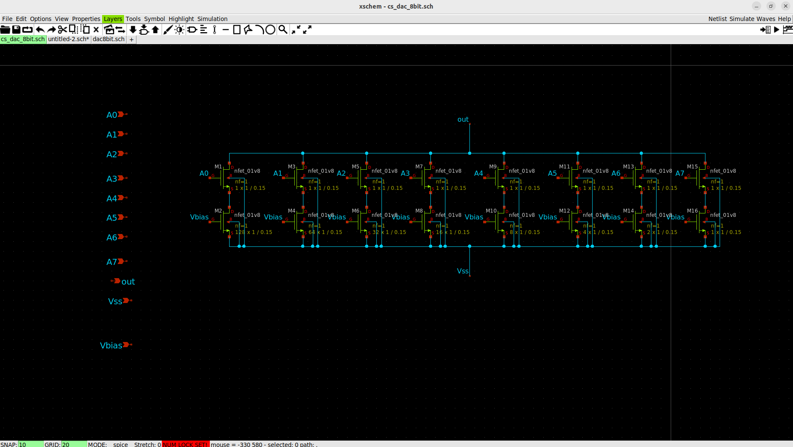
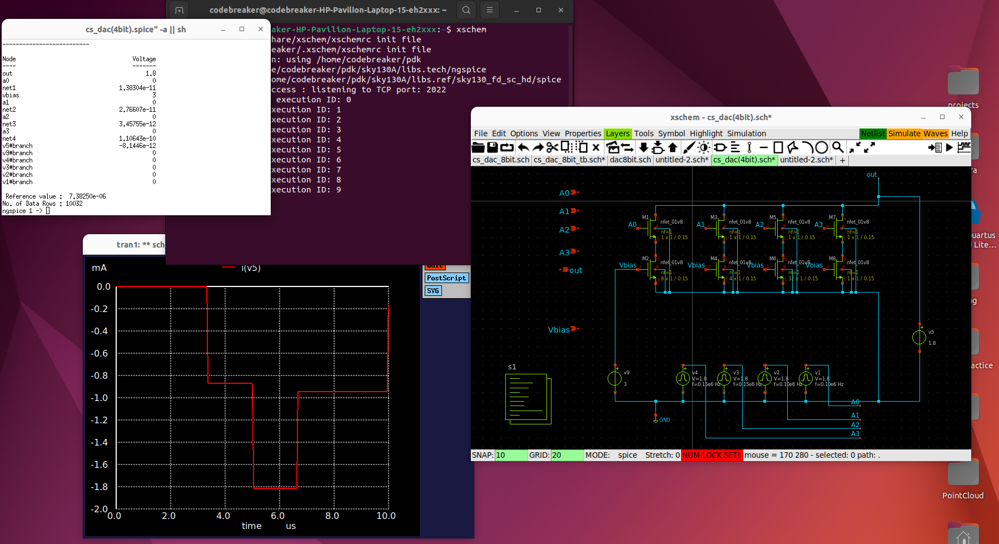

# Low Power Mixed Signal Design of CNN Operator for AI Acceleration

## Abstract

This report explores an analog-based approach to CNN acceleration, emphasizing energy efficiency in resource-constrained embedded environments. The architecture integrates mixed-signal elements for CNN convolution, multiplication, accumulation, and activation, leveraging the power and speed of analog circuits. This design targets applications requiring low power consumption, real-time processing, and high-speed inference, such as embedded AI in image processing.

---

## 1. Introduction

The growth of AI and deep learning has amplified the demand for high-performance hardware accelerators capable of efficiently handling large computations. Convolutional Neural Networks (CNNs), in particular, are widely used in tasks like image recognition but often require significant computational power, leading to challenges in latency and power consumption. Traditional digital accelerators handle these computations but can be inefficient for real-time applications. This report presents a low-power analog accelerator that performs core CNN operations, including multiplication, accumulation, activation (ReLU), and pooling, while avoiding digital conversion where possible.

### Problem Statement

In digital CNN accelerators, the multiply-and-accumulate (MAC) operations consume considerable power and introduce latency due to digital-to-analog (D/A) and analog-to-digital (A/D) conversions. Analog circuits, by contrast, can perform these operations directly with minimal energy consumption and without the need for digital representation, potentially providing real-time inference with lower power consumption.

---

## 2. Circuit Design and Mathematical Formulation

### 2.1 Current-Steering Digital-to-Analog Converters (8-bit and 4-bit DACs)

The DACs convert binary digital values to analog currents, essential for initiating the convolution operation. This project includes an 8-bit DAC multiplier and a 4-bit DAC multiplier to explore the trade-offs in precision and power consumption.

**Schematic (8-bit Current Steering DAC):**

**Schematic (4-bit Current Steering DAC):**

#### Mathematical Formulation

For an $$\( n \)$$-bit DAC with a digital input $$\( D \)$$ (in decimal) and reference current $$\( I_{ref} \)$$, the output current $$\( I_{out} \)$$ is given by:

$$[I_{out} = (D / 2^n) * I_{ref}]$$(images/dac_equation.svg)

- $$\( D \)$$: Decimal representation of the binary input.
- $$\( n \)$$: Number of bits in the DAC.
- $$\( I_{ref} \)$$: Reference current.

The 8-bit DAC provides higher precision, while the 4-bit DAC is more power-efficient, making it suitable for applications where lower precision is acceptable.

**Waveform (8-bit DAC Output):**

### 2.2 Multiplier Circuits for DACs

The multiplier circuit uses current mirrors to multiply the DAC output with another analog input. The circuit configuration allows precise scaling through transistor sizing, supporting both 8-bit and 4-bit multipliers.

**Schematic (8-bit Multiplier):**

**Schematic (4-bit Multiplier):**

#### Mathematical Formulation

The output current $$\( I_{out} \)$$ of the multiplier circuit depends on the DAC output $$\( I_{DAC} \)$$, an additional input current $$\( I_{in} \)$$, and transistor ratios $$\( k_1 \)$$ and $$\( k_2 \)$$. For a general analog multiplier:

$$[I_{out} = k_1 * I_{DAC} * k_2 * I_{in}]$$(images/multiplier_equation.svg)

where:
- $$\( k_1 \)$$ and $$\( k_2 \)$$ represent scaling factors from transistor (W/L) ratios.
- $$\( I_{DAC} \)$$: DAC output current.
- $$\( I_{in} \)$$: Secondary input current.

This output is directly proportional to the product of $$\( I_{DAC} \)$$ and $$\( I_{in} \)$$, implementing a multiplication operation in the analog domain.

### 2.3 Analog Integrator for Accumulation

The integrator sums the products generated by the multiplier circuit, combining results from multiple operations without A/D conversion, which reduces power and latency.

**Schematic:**

#### Mathematical Formulation

For an integrator with capacitance $$\( C \)$$ and input current $$\( I_{in} \)$$, the output voltage $$\( V_{out} \)$$ over time $$\( t \)$$ is given by:

$$[V_{out(t)} = (1 / C) * int_{t = 0}^t I_{in} dt + V_{initial}]$$(images/integrator_equation.svg)

This formulation shows the continuous accumulation of input current over time, providing the summation needed in MAC operations.

### 2.4 Max Pooling Circuit

The max pooling circuit performs down-sampling by retaining the maximum value within a region. This circuit outputs the highest current value from a set, representing the maximum activation in analog form.

**Schematic:**

#### Mathematical Formulation

For inputs $$\( \{I_1, I_2, \dots, I_n\} \)$$, the max pooling circuit outputs:

$$\[
I_{max} = \max(I_1, I_2, \dots, I_n)
\]$$

This reduces data while retaining essential features, making it a crucial component in CNNs.

### 2.5 ReLU Circuit for Activation Function

The Rectified Linear Unit (ReLU) introduces non-linearity into the network by zeroing out negative values while allowing positive values to pass.

**Schematic:**

#### Mathematical Formulation

For an input current $$\( I_{in} \)$$, the output $$\( I_{out} \)$$ is given by:

$$\[
I_{out} = \max(0, I_{in})
\]$$

---

## 3. Simulation Results

### 3.1 8-bit DAC Waveform

**Waveform:**

The waveform shows accurate digital-to-analog conversion for the 8-bit DAC, reflecting high precision.

### 3.2 Multiplier Circuit Waveforms

**8-bit Multiplier Waveform:**

**4-bit Multiplier Waveform:**

These waveforms validate the accuracy and functionality of the multiplier circuits for both the 8-bit and 4-bit configurations.

### 3.3 ReLU Circuit Simulation

**Waveform:**

The ReLU waveform shows that the circuit accurately outputs zero for negative inputs and allows positive currents to pass.

### 3.4 Max Pooling Circuit Simulation

**Waveform:**

---

## 4. Conclusion and Future Work

This analog accelerator design provides efficient MAC operations for CNNs in resource-constrained environments. Through analog implementation, the design reduces power consumption and latency. Future improvements include:
- Component optimization for power and speed.
- Support for multi-channel convolutions.
- Expanded testing with diverse embedded applications.

---

## 5. References

1. Razavi, B., “The Current-Steering DAC [A Circuit for All Seasons],” IEEE Solid-State Circuits Magazine, vol. 10, no. 1, pp. 11-15, Winter 2018.
2. Asghar, M. S., et al., “A Digitally Controlled Analog Kernel for Convolutional Neural Networks,” ISOCC 2021.
3. Zhu, J., et al., “Analog Implementation of Reconfigurable Convolutional Neural Network Kernels,” APCCAS 2019.

---
